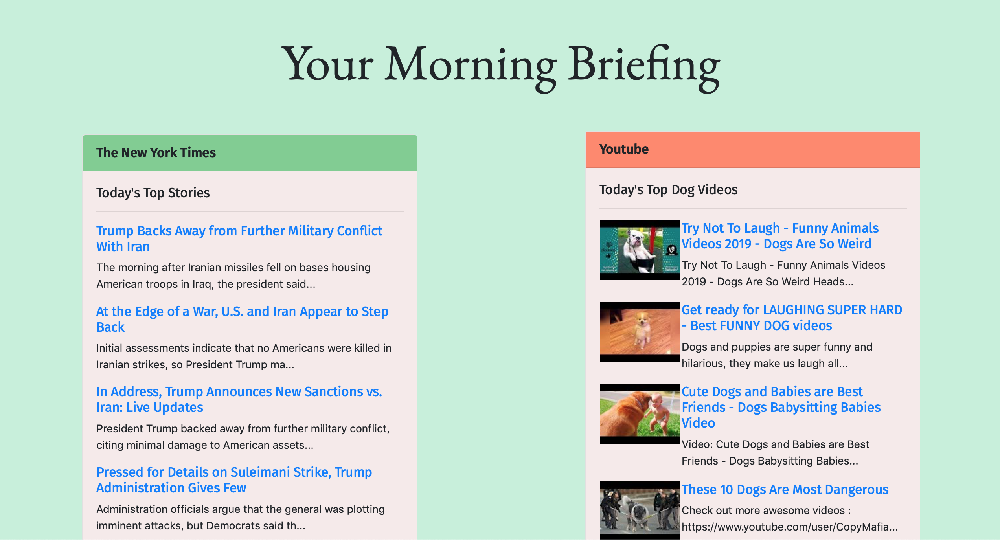

# News Brief
by Mingjia Wang and Pranav Acharya

News Brief is a website we created to consolidate the day's top headlines, trends, and videos all in one place. It is meant to provide people with the news and information they need to know -- all on a single website.

## Overview

News Brief is coded in HTML, CSS, Javascript, and Bootstrap for the front end. 

## Screenshots

News Brief shown running on desktop. 

## What's next for News Brief

We plan to expand News Brief to eventually include a variety of news sites and social media platforms, giving users the ability to choose the sources that they receive their news from. We will allow users to customize the number of articles/results from each source, the theme/colors of the webpage, and support for logins to save individual user settings.
